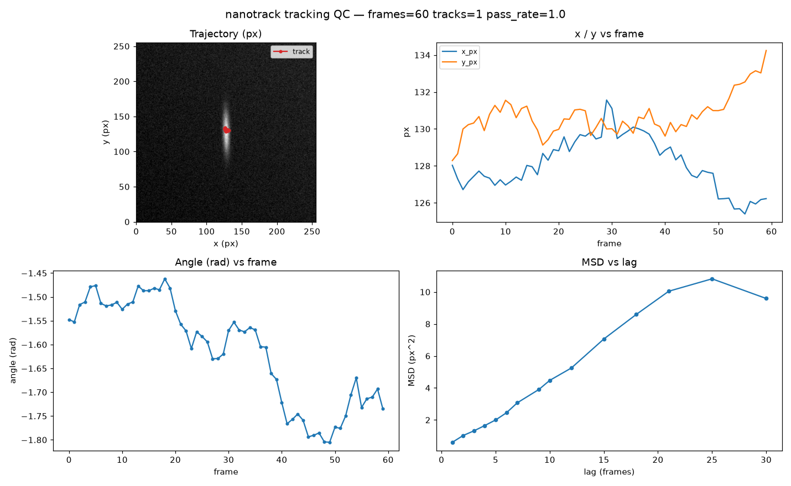
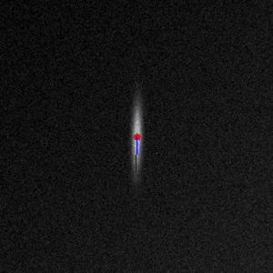

# nanotrack

Single-molecule nanoparticle video tracking pipeline (SPT), reimplemented from the
author's MATLAB methodology (see `docs/implementation-plan.md` for the decision-complete
spec).

> Status: Phase 1 in progress — core NumPy pipeline. `ref/` (papers + MATLAB source) is
> local-only and not part of the repository.

## Quick start

```bash
make venv && make install   # create .venv and install dependencies
make smoke                  # end-to-end smoke test (40 frames, 1 molecule)
make sample && make run     # write sample data and run the pipeline
python scripts/run_pipeline.py --input video.tif --out output   # analyze a real video
python scripts/run_pipeline.py --out output --resume            # rebuild from detections.csv
```

Each run also writes `output/tracking_report.html` — a self-contained tracking-QC
dashboard (trajectory, x/y vs frame, angle vs frame, MSD). With the API up, open
`http://localhost:8000/tracking`.

### Docker stack (local)

```bash
mkdir -p output && chmod -R 777 output   # Airflow runs as a non-root user
docker compose up --build
```

Services: API `:8000`, Airflow `:8080`, Prometheus `:9090`, Grafana `:3000`.

## Example outputs

**Tracking QC report** — an interactive HTML report is written to
`output/tracking_report.html` after every run (trajectory overlaid on the first frame,
x/y vs frame, unwrapped angle in rad vs frame, MSD vs lag). Static preview:



**Tracking overlay video** — `--overlay` draws the tracked trajectory and orientation
onto the input video (`output/tracking_overlay.mp4`, or `.gif` / `.png` via
`--overlay-format`). Example on a single-molecule (vertical-rod) video:



## Layout

```
src/nanotrack/   core package
scripts/         CLI entrypoints
tests/           pytest suite
docs/            implementation plan + system design
```
