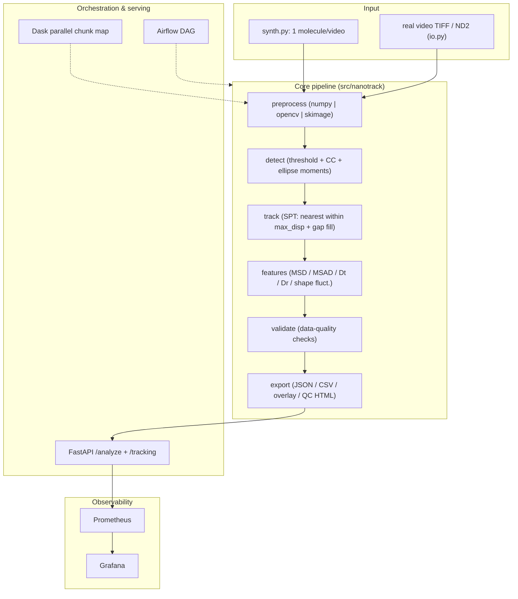
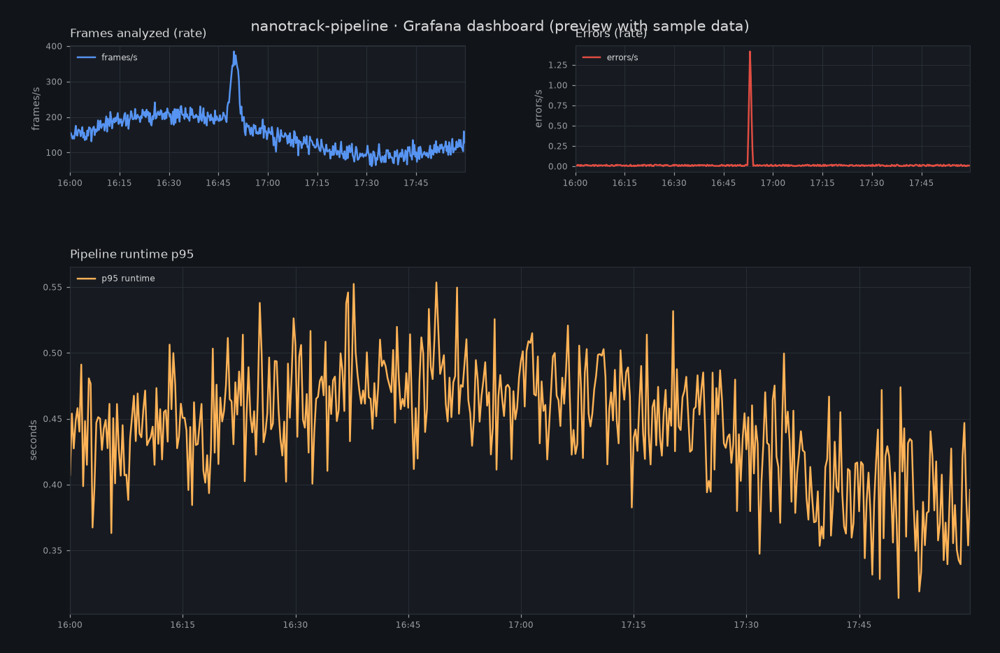
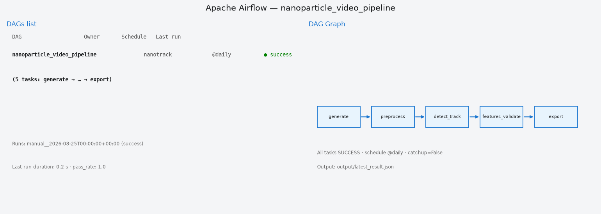
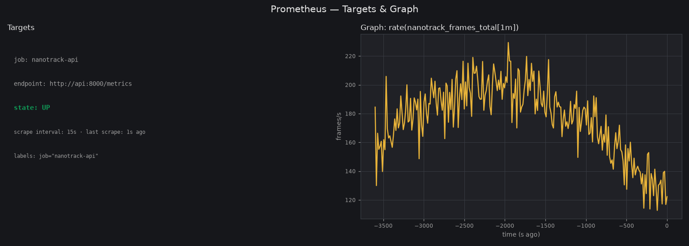
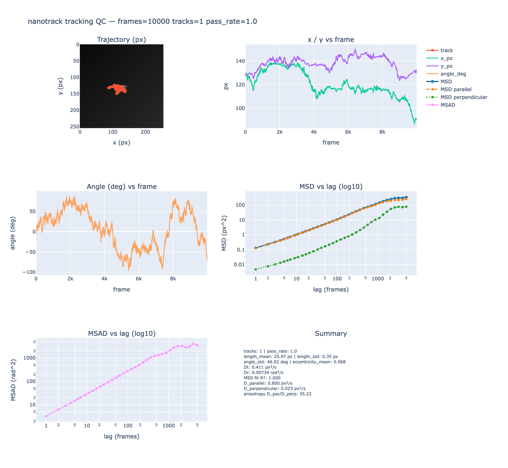

# nanotrack

[](https://github.com/zt5rice/nanoparticle-video-pipeline/actions)

Single-molecule nanoparticle video tracking pipeline (SPT), reimplemented from the
author's MATLAB methodology (see `docs/implementation-plan.md` for the decision-complete
spec).

## Overview

**nanotrack** is an end-to-end, single-molecule (SPT) nanoparticle video-tracking
pipeline, re-engineered from the author's MATLAB methodology into a modern Python
data-infrastructure stack — a working-experience project for a Software Development
Engineer specializing in data infrastructure.

- **Computer-vision core** — frame-accurate detection of fast-moving, flexible
  nanoparticles (nanorods, nanosheets, single-walled carbon nanotubes): connected
  components + moment-based ellipse features, three interchangeable preprocessing
  backends (NumPy reference / OpenCV / scikit-image), and mod-180° orientation
  unwrapping so vertical rods track stably without fake ±90° jumps.
- **Parallelism & HPC** — Dask chunked processing with a sequential fallback, plus a
  SLURM batch example that mirrors the original "15 hours → 30 minutes" cluster
  speedup for long (10k-frame) videos.
- **Serving & orchestration** — FastAPI REST API (`/analyze`, `/tracking`), an Airflow
  DAG (`generate → preprocess → detect_track → features_validate → export`), and a
  Docker Compose stack (API / Airflow / Postgres / Prometheus / Grafana).
- **Observability** — Prometheus metrics (frames analyzed, errors, runtime p95) with a
  provisioned Grafana `nanotrack-pipeline` dashboard.
- **Data engineering & reproducibility** — immutable per-run artifacts (raw per-frame
  `tracks.csv` / `detections.csv`, config + ground-truth provenance), checkpoint
  resume (`--resume`), self-contained tracking-QC HTML reports, and tracking-overlay
  videos for visual QA.
- **CI/CD & delivery** — GitHub Actions CI (ruff, pytest, smoke) plus a Docker
  end-to-end job that boots the full stack and validates the Airflow DAG.
- **Research impact** — methods support 12 peer-reviewed publications, including
  ACS Nano and Soft Matter.

The pipeline ships as the `nanotrack` Python package with a CLI, REST API, and
ImageJ-style preprocessing notebook — usable end-to-end on synthetic data or real
fluorescence videos (TIFF / ND2).

> `ref/` (papers + MATLAB source) is local-only and not part of the repository.

## System design



See [`docs/system-design.md`](docs/system-design.md) for the component table and data flow.

## Quick start

```bash
make venv && make install   # create .venv and install dependencies
make smoke                  # end-to-end smoke test (40 frames, 1 molecule)
make sample && make run     # write sample data and run the pipeline
python scripts/run_pipeline.py --input video.tif --out output   # analyze a real video
python scripts/run_pipeline.py --out output --resume            # rebuild from detections.csv
python scripts/run_pipeline.py --input video.tif --out output --overlay  # + trajectory overlay video
```

Each run also writes `output/tracking_report.html` — a self-contained tracking-QC
dashboard (trajectory, x/y vs frame, angle vs frame, MSD). With the API up, open
`http://localhost:8000/tracking`.

### Full stack (Airflow · Prometheus · Grafana)

Bring up the whole stack — API + Airflow + Postgres + Prometheus + Grafana:

```bash
mkdir -p output && chmod -R 777 output   # Airflow runs as a non-root user
docker compose up --build -d
docker compose ps
```

Then walk through the four services:

1. **API** — `http://localhost:8000/health` (FastAPI; interactive docs at `/docs`).
2. **Airflow** — `http://localhost:8080` (login `admin` / `admin`): trigger the
   `nanoparticle_video_pipeline` DAG (`generate → preprocess → detect_track →
   features_validate → export`); the run writes `output/latest_result.json`.
3. **Prometheus** — `http://localhost:9090/targets` shows the `nanotrack-api` job
   (`health = up`); raw metrics at `http://localhost:8000/metrics`.
4. **Grafana** — `http://localhost:3000` (login `admin` / `admin`): open the
   provisioned **nanotrack-pipeline** dashboard (frames analyzed, errors, runtime p95).

Minimal end-to-end smoke:

```bash
curl -sf http://localhost:8000/health
curl -sf -X POST http://localhost:8000/analyze \
  -H 'Content-Type: application/json' -d '{"n_frames":60,"backend":"numpy"}'
docker compose exec -T airflow-webserver airflow dags test \
  nanoparticle_video_pipeline $(date +%Y-%m-%d) || true
test -f output/latest_result.json
```

> Credentials above (`admin`/`admin`, `airflow`/`airflow`) are **local dev defaults only**.

## Example outputs

**Observability & orchestration stack** (simulated previews with sample data; see the
real stack via `docker compose up` — Airflow `:8080`, Prometheus `:9090`, Grafana
`:3000`):







**Tracking QC report** — an interactive HTML report is written to
`output/tracking_report.html` after every run (trajectory overlaid on the first frame,
x/y vs frame, unwrapped angle in deg vs frame, MSD/MSAD vs lag on log-log (base 10)
axes, and a run summary). Static preview:


**Tracking QC report — 10,000-frame synthetic video (parallel/perpendicular MSD trend)** —
the full 3×2 QC report from a synthetic 10,000-frame single-molecule rod video with
anisotropic body-frame diffusion (`D_∥ >> D_⊥`) plus rotational diffusion (`--max-lag 5000`).
The MSD panel shows the Fakhri et al. (Science 2010) parallel/perpendicular MSD regimes:
anisotropic short-time `Δs² >> Δn²`, the super-linear crossover `Δn² ~ D∥·D_r·t²`, and
isotropic convergence beyond `τ_r = 1/(2D_r)`:



**Tracking overlay video** — `--overlay` draws the tracked trajectory and orientation
onto the input video (`output/tracking_overlay.mp4`, or `.gif` / `.png` via
`--overlay-format`). Example on a single-molecule (vertical-rod) video:


## Citation

If you use this tool in your work, please cite the methodology paper:

> Z. Tang, S. L. Eichmann, B. Lounis, L. Cognet, F. C. MacKintosh, M. Pasquali,
> *Single-walled carbon nanotube reptation dynamics in submicron sized pores from
> randomly packed mono-sized colloids*, Soft Matter **2022**.
> DOI: [10.1039/D2SM00305H](https://doi.org/10.1039/D2SM00305H)

The parallel/perpendicular MSD method follows:

> N. Fakhri, F. C. MacKintosh, B. Lounis, L. Cognet, M. Pasquali,
> *Brownian Motion of Stiff Filaments in a Crowded Environment*, Science **2010**,
> 330 (6012), 1804–1807.
> DOI: [10.1126/science.1197321](https://doi.org/10.1126/science.1197321)

## Timeline & provenance

- **2020–2024 — research & methodology**: the tracking methodology (MATLAB) and the
  underlying experiments/publications — J. Phys. Chem. B **2020** (BNNT), Soft Matter
  **2022** (SWCNT reptation), ACS Nano **2024** (h-BN nanosheets).
- **2026 — engineering reimplementation**: this repository re-engineers that research
  methodology into a production-grade data-infrastructure stack (Python package, CLI,
  FastAPI, Airflow, Docker Compose, Prometheus/Grafana, GitHub Actions CI/CD).

## Layout

```
src/nanotrack/   core package
scripts/         CLI entrypoints
tests/           pytest suite
docs/            implementation plan + system design
```
