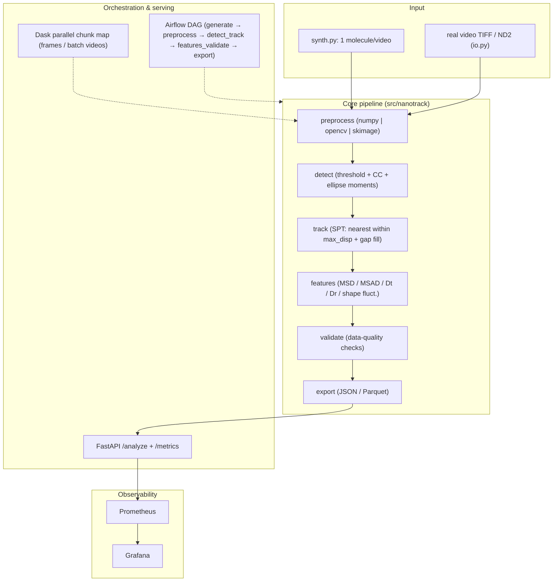

# nanoparticle-video-pipeline — Decision-Complete Implementation Plan (v2)

> **Status**: authoritative execution spec. Supersedes the high-level roadmap in
> [`../phased_plan_en.md`](../phased_plan_en.md). Scope: **single-molecule tracking
> (SPT)** — exactly one molecule per field of view; multiple-particle tracking (MPT)
> is intentionally out of scope.

## 1. Summary & Current State

The repository currently contains only the phased plan documents (`phased_plan_en.md`
`phased_plan_cn.md`) and a `ref/` folder with reference papers and MATLAB source
archives. There is **no source code, `.venv`, README, tests, or CI** yet. The single
existing commit (`5824469 docs: add phased implementation plan (EN/CN)`) is pushed to
`github.com/zt5rice/nanoparticle-video-pipeline` (main).

**Goal**: build a data-engineering-style reimplementation of the author's MATLAB
nanoparticle video-analysis methodology as a Python package `nanotrack` (0.1.0),
delivered in four phases, with Linear-created tickets, bilingual plan docs, GitHub
Actions CI, and a GitHub release. Demo runs on synthetic data by default; real-video
loaders (TIFF/ND2) are supported but not required in CI.

**Algorithm source of truth**: the MATLAB code in `ref/SWNTs trackingV3.zip` (canonical)
plus the four papers in `ref/` (see §3). The implementation must be faithful to the
MATLAB method: global-threshold binarization → hole filling → connected components →
moment-based ellipse features → single-object tracking with gap interpolation → MSD/MSAD
analysis → data-quality validation → export.

## 2. Locked Decisions (do not change during implementation)

- **Single-molecule SPT**: each video contains exactly 1 molecule. Detection may find
  multiple blobs; the pipeline selects the **largest-area blob per frame** as the primary
  object and flags anomalies in the quality report. No multi-target association,
  merging, or splitting is implemented.
- Full 4-phase decision-complete spec; **Docker end-to-end acceptance runs only in
  GitHub Actions** (local machine has no Docker); local verification goes to
  "code + unit tests + ruff + uvicorn" level.
- Linear: create project `nanoparticle-video-pipeline` in team `Zhao_tang`
  (id `f8e0f74b-c3f5-443c-ae81-c15fa9297623`) with 4 milestones and **22 tickets**
  (breakdown in §9); one ticket = one PR (`codex/<issue-id>-<slug>` branch;
  commit/PR prefix `<ISSUE-ID>: type(scope): ...`); ticket marked Done only after its PR
  is merged/closed.
- Python 3.11 + `pip`/`requirements*.txt` (no uv/poetry); package `nanotrack` 0.1.0;
  MIT license; English code comments; docs in English + Chinese execution version.
- `ref/` (papers + both MATLAB archives) is **local-only**: never committed or pushed to
  GitHub; `.DS_Store`, `output/`, and `.venv/` are gitignored.
- Network operations (pip install, Linear API, git fetch/push, GitHub checks) require
  per-command escalation. Push uses the **user's default GitHub SSH key** (verified
  registered to GitHub user `zt5rice`); no custom key file path is required. Phase 4
  includes a push pre-check gate (see §6).

## 3. Reference Materials (`ref/`)

> `ref/` is **local-only** and is never committed or pushed to GitHub.

| File | Content | Role in implementation |
|---|---|---|
| `10186211.pdf` | BNNT real-time Brownian motion (rod-like, fluorescence) | MSD/MSAD method: internal averaging, `MSD=4Dt·Δt+C`, `MSAD=2Dr·Δt+C` |
| `10575298.pdf` | h-BN nanosheets / graphene 2D diffusion | 2D translation diffusion, Kramers theory context; ~18 fps imaging |
| `SM_d2sm00305h_zt.pdf` | SWCNT reptation in packed colloids (Soft Matter) | Ellipse-fit COM/orientation; TA-MSD; bending angle via rotated-parabola fit; Gittes backbone protocol |
| `jc1204923.pdf` | Gittes et al. 1993, flexural rigidity from thermal shape fluctuations | Backbone extraction, arc-length tangent angle, Fourier-mode / parabola bending analysis |
| `SWNTs trackingV3.zip` | **Canonical** MATLAB code | Direct port source (see mapping below) |
| `SWNTs tracking.rar` | Older development snapshot | Provenance only; no algorithm change (diff summary in `ref/README.md`) |

### References

1. A. D. Smith McWilliams, Z. Tang, S. Ergülen, C. A. de los Reyes, A. A. Martí, M. Pasquali,
   *Real-Time Visualization and Dynamics of Boron Nitride Nanotubes Undergoing Brownian Motion*,
   J. Phys. Chem. B **2020**, 124 (20), 4185–4192. DOI:
   [10.1021/acs.jpcb.0c03663](https://doi.org/10.1021/acs.jpcb.0c03663).
2. U. Umezaki, A. D. Smith McWilliams, Z. Tang, Z. M. S. He, I. R. Siqueira, S. J. Corr,
   H. Ryu, A. B. Kolomeisky, M. Pasquali, A. A. Martí, *Brownian Diffusion of Hexagonal Boron
   Nitride Nanosheets and Graphene in Two Dimensions*, ACS Nano **2024**, 18 (3), 2446–2454.
   DOI: [10.1021/acsnano.3c11053](https://doi.org/10.1021/acsnano.3c11053).
3. Z. Tang, S. L. Eichmann, B. Lounis, L. Cognet, F. C. MacKintosh, M. Pasquali,
   *Single-walled carbon nanotube reptation dynamics in submicron sized pores from randomly
   packed mono-sized colloids*, Soft Matter **2022**. DOI:
   [10.1039/D2SM00305H](https://doi.org/10.1039/D2SM00305H).
4. F. Gittes, B. Mickey, J. Nettleton, J. Howard, *Flexural Rigidity of Microtubules and Actin
   Filaments Measured from Thermal Fluctuations in Shape*, J. Cell Biol. **1993**, 120 (4),
   923–934. DOI: [10.1083/jcb.120.4.923](https://doi.org/10.1083/jcb.120.4.923).

### Key parameters (from `main.m`, V3)

`featsize(masscut)=10`, `stdThreshold=3.0`, `maxdisp=10 px`, `goodenough=20 frames`,
`memory=3 frames`, `fps=16.75`, `inv=0` (dark-field fluorescence), `100x → 0.302 µm/px`.

### MATLAB → `nanotrack` mapping

| MATLAB (V3) | `nanotrack` module |
|---|---|
| `bpassSWNT` (global threshold `(imgstd + stdThreshold*imgmean)/256`, cap 0.90) | `preprocessing.py` (numpy reference backend) |
| `localmaxFlow` (imfill, bwlabel, regionprops: intensity-weighted COM, MajorAxisLength, Eccentricity, second-moment orientation; masscut filter) | `detection.py` |
| `trackmem` (Crocker–Grier MPT) → **simplified to SPT** | `tracking.py` (single-object, `max_disp`, `memory`, `min_track_len`) |
| `putting_in_missing_frames6` (linear interpolation of missing frames) | `tracking.py` gap fill |
| `pixtomicro6` (`0.302 µm/px`) | `config.pixels_per_micron` |
| `conversions_no_dd_SWNT` / `getting_individual_SWNTs` | `pipeline.py` (µm conversion, per-track export) |
| MSD/MSAD in papers | `features.py` |
| Gittes backbone / bending angle | `features.shape_fluctuations()` |

## 4. System Design



## 5. Interfaces & Data Contracts

### `PipelineConfig` (dataclass + `from_yaml()`)

`backend: "numpy"|"opencv"|"skimage"` (default `numpy`), `image_size: int=512`,
`n_frames: int`, `threshold_mult: float=3.0`, `min_feature_size: int=10`,
`max_disp: float=10.0`, `min_track_len: int=20`, `memory: int=3`,
`fps: float=16.75`, `dt: float=1/16.75`, `pixels_per_micron: float=0.302`,
`noise_sigma: float=8.0`, `background_strength: float=20.0`,
`particle_length_px: int=40`, `particle_width_px: int=6`,
`brownian_step_px: float=0.5`, `angle_step_rad: float=0.03`,
`initial_angle_deg: float=0.0`,
`max_lag: int=min(50, n_frames//2)`, `msd_fit_frac: float=0.25`,
`msd_n_lags: int=40`,
`chunk_size: int=16`, `dask_scheduler: str="threads"`, `seed: int=0`,
`out_dir: str="output"`.

### `synth.generate(cfg) -> (frames: uint8 [T,H,W], ground_truth: dict)`

Exactly **1** rod-like elliptical Gaussian blob (peak ~180–220) on a dark background
(~20 + smooth gradient, `noise_sigma`). COM Brownian random walk (`brownian_step_px`)
and angle random walk (`angle_step_rad`).

`ground_truth = {"n_molecules": 1, "particles": [{"id": 1, "x", "y", "angle", "length", "width", "area", "intensity"} per frame]}`

### `preprocess(frame, backend, cfg) -> mask: bool[H,W]`

- `numpy` (reference): faithful port of `bpassSWNT` —
  `thr = (std(std(frame, axis=1)) + threshold_mult*mean(frame))/256`, cap at 0.90,
  `mask = frame > thr`.
- `opencv`: same threshold logic + optional Gaussian/median denoise and morphology open.
- `skimage`: Otsu threshold + morphology open.

Acceptance: primary-object position/count consistent across backends within tolerance
(no pixel-identical requirement).

### `detect(mask, cfg) -> list[Blob]`

`Blob = {"id", "x", "y", "angle", "length", "width", "area", "eccentricity"}`.
Hole fill (`imfill`), connected-component labeling, image moments (centroid = bright-pixel
mean; `MajorAxisLength`; `Eccentricity`; orientation `0.5*atan2(2*Mxy, Mxx-Myy)`);
`masscut` filter: `(max(x)-min(x)) + (max(y)-min(y)) > min_feature_size`.

### `track(blobs_per_frame, cfg) -> Track`

Single-object tracking: each frame pick largest-area blob; link to nearest blob within
`max_disp`; keep track through up to `memory` missing frames and back-fill them by
**linear interpolation** (`putting_in_missing_frames6` semantics); discard if
`len(track) < min_track_len`.

`Track = {"track_id": 1, "frames": [{"frame", "x_px", "y_px", "angle", "length", "eccentricity"}], "x_um", "y_um"}`

### `features.summarize(track, cfg)`

Per-track: `length_mean`, `length_std`, `angle_std`, `eccentricity_mean`,
`diffusion_coefficient_px2_per_s`, `rotational_diffusion_coefficient_rad2_per_s`,
`msd_fit_r2`. MSD/MSAD use **internal averaging** (all pairs at each lag) evaluated at
~`msd_n_lags` (default 40) lags evenly spaced in **log scale** — fast for long videos and
consistent with the published papers; `msd_curve_full`/`msad_curve_full` provide the
exhaustive per-lag version for tests/correctness. Linear fit over the first
`msd_fit_frac` of lags; `Dt = slope/4`, `Dr = slope/2`. Shape fluctuation follows the
Gittes protocol: skeleton backbone → arc-length parametrization → tangent angle →
rotated-parabola bending angle (mean/std in v1; Fourier modes optional, not in v1
acceptance). Orientation is unwrapped mod 180° during tracking (vertical rods do not
fake-jump at ±90°), and MSAD wraps angular deltas to [-90°, 90°).

### `validation.report(track, cfg) -> DataQualityReport`

Checks: frame coverage (≥`min_track_len` and ≥90% frames), length/orientation sanity,
MSD fit `R²≥0.7`, exactly-one-primary-object per frame (0 or >1 flagged). Output
`pass_rate` = passed/total.

### `result.json`

```json
{
  "version": "0.1.0",
  "config": {},
  "n_frames": 40,
  "n_detections": 40,
  "n_tracks": 1,
  "summary": {
    "track_id": 1,
    "length_mean": null,
    "length_std": null,
    "angle_std": null,
    "eccentricity_mean": null,
    "diffusion_coefficient_px2_per_s": null,
    "rotational_diffusion_coefficient_rad2_per_s": null,
    "msd_fit_r2": null
  },
  "quality": {"pass_rate": 0.99, "checks": []}
}
```

### API (Phase 3)

- `GET /health` → `{"status": "ok"}`
- `POST /analyze` body `{"n_frames": int(10..500), "backend": "numpy|opencv|skimage", "image_size"?: int=512, "seed"?: int}` →
  `{"n_frames", "n_tracks", "n_detections", "quality_pass_rate", "tracks": [{track_id, length_mean, length_std, angle_std, eccentricity_mean, diffusion_coefficient_px2_per_s, rotational_diffusion_coefficient_rad2_per_s}]}`
  (invalid input → 422). **No `n_particles` field** (single molecule).
- `GET /metrics` → Prometheus text; counters `nanotrack_frames_total`,
  `nanotrack_errors_total`, histogram `nanotrack_runtime_seconds`; disable via
  `NANOTRACK_METRICS_ENABLED=false`.
- `GET /tracking?out=<dir>` → serves the tracking-QC HTML report
  (`<dir>/tracking_report.html`; 404 if missing). The CLI writes this report after
  every run (trajectory overlay, x/y vs frame, angle vs frame, MSD vs lag).

### CLI & Airflow

- `python scripts/run_pipeline.py --backend {numpy|opencv|skimage} --config config.yaml --out output`
- Real videos: `python scripts/run_pipeline.py --input video.tif --out output` (TIFF/ND2;
  analyzes the whole movie, or `--n-frames N` for a prefix)
- Raw artifacts: the CLI writes `detections.csv` and `tracks.csv` (per-frame px/µm,
  angle deg/rad), `config.yaml`, and (for synthetic input) `ground_truth.json` next to
  `result.json`; `--resume` rebuilds result/tracks from an existing `detections.csv`,
  skipping the expensive image-analysis stage.
- Airflow DAG `nanoparticle_video_pipeline`: `generate → preprocess → detect_track →
  features_validate → export`, `@daily`, `catchup=False`, LocalExecutor; writes
  `output/latest_result.json` (same schema as `result.json`).

## 6. Implementation Phases

### Phase 0 — Docs & Linear initialization

- Create `docs/implementation-plan.md` (EN) + `docs/implementation-plan.zh-CN.md`;
  point `phased_plan_en/cn.md` to this spec; add `ref/README.md` (inventory + provenance).
- Create Linear project `nanoparticle-video-pipeline` (team `Zhao_tang`), 4 milestones,
  22 tickets (content per this v2 spec), record returned issue IDs.
- **Acceptance**: Linear project + 22 tickets visible; docs committed.

### Phase 1 — Scaffold & core NumPy SPT pipeline + tests

- `.gitignore` (`.venv/`, `output/`, `.DS_Store`), `LICENSE` (MIT), `pyproject.toml`,
  `requirements.txt` (header `# nanotrack 0.1.0`), `requirements-dev.txt`, `Makefile`;
  `python3.11 -m venv .venv` + install (needs escalation).
- `src/nanotrack/{config,synth,preprocessing,detection,tracking,features,validation,parallel,pipeline}.py`;
  `scripts/{run_pipeline,make_sample_data,smoke_test}.py`.
- Tests: `test_synth`, `test_preprocessing`, `test_detection`, `test_tracking`,
  `test_features`, `test_validation`.
- **Acceptance**: `import nanotrack` ok; `make smoke` prints `SMOKE OK` with
  `quality_pass_rate>=0.99` (40 frames, 1 molecule, numpy backend); `pytest` green;
  `make sample && make run` writes schema-valid `output/result.json`.

### Phase 2 — CV backends, Dask, real video, notebook

- Three preprocessing backends + dispatcher; `io.py` (tifffile TIFF; optional `nd2`,
  clear `pip install nd2` error when missing); `parallel.py` Dask chunk map over
  frames/batch videos (sequential fallback); `scripts/slurm_example.sh` (batch-video
  parallel narrative); `notebooks/imagej_style_preprocessing.ipynb` (rolling-ball +
  median + Otsu, ImageJ command mapping, no JVM).
- Tests: backend consistency, TIFF roundtrip (using `Artificial8bit.tif` extracted from
  `ref/SWNTs trackingV3.zip` to a temp dir), Dask == sequential.
- **Acceptance**: `pytest` green; `--backend opencv|skimage` succeed; notebook renders.

### Phase 3 — API, Airflow, Docker, observability

- `api.py` / `metrics.py` (contracts in §5); `dags/nanoparticle_pipeline.py`;
  `Dockerfile` (python:3.11-slim + uvicorn), `docker-compose.yml` (postgres:16,
  airflow 2.9.3 LocalExecutor, api, prometheus, grafana), `prometheus/prometheus.yml`,
  Grafana provisioning (datasource + `nanotrack-pipeline` dashboard).
- Tests: `test_api` (TestClient: /health, /analyze ok + 422, /metrics), DAG parse.
- **Local acceptance**: `uvicorn nanotrack.api:app --port 8000`; curl `/health`,
  `/analyze` (pass_rate≥0.99), `/metrics`; `pytest` green.
- **CI e2e**: GitHub Actions `docker-e2e` job (ubuntu-latest): `docker compose up
  --build`, check 8000/8080/9090/3000, curl three endpoints, Airflow run writes
  `output/latest_result.json`.

### Phase 4 — CI, docs, GitHub release

- `.github/workflows/ci.yml`: `lint-test` (Python 3.11: `ruff check src tests dags` →
  `pytest` → `scripts/smoke_test.py`) + `docker-e2e`.
- `README.md` (quickstart, architecture diagram, tooling-mapping table, reference
  citations, license) and `docs/system-design.md` (this spec's diagram). `ref/` itself is
  local-only and not published.
- **Push pre-check gate**: `ssh -T git@github.com` with the **user's default GitHub SSH
  key** (verified working, user `zt5rice`); if `publickey` fails, pause and ask user to fix
  the key (or provide HTTPS PAT via env). Never force-push; non-fast-forward →
  `git pull --rebase`.
- **Acceptance**: Actions green; full repo tree on GitHub; Linear tickets Done after
  merges.

## 7. Test Plan

- **Unit**: synth (1 molecule, shape/dtype/ground-truth, seed reproducibility);
  preprocessing (3 backends, primary-object consistency, deterministic);
  detection (known ellipse → x/y/angle/length/ecc within tolerance; 0 blobs; largest-blob
  selection); tracking (continuity, gap-fill ≤ memory, discard on > memory, lost on
  > max_disp); features (linear MSD → Dt tolerance, MSAD → Dr, angle wrap, bending angle);
  validation (pass/fail cases incl. multi-blob flag).
- **Integration**: smoke (40 frames / 1 molecule / pass_rate≥0.99); sample→run→
  `result.json` schema; three backends via CLI; real `Artificial8bit.tif` io roundtrip.
- **E2E (CI)**: compose stack; `/health`, `/analyze` (pass_rate≥0.99), `/metrics`
  contains `nanotrack_frames_total`; Airflow successful run writes `latest_result.json`.
- **Gates**: all phase tests + acceptance commands green before next phase; PR merges
  require CI green.

## 8. Assumptions & Defaults

- **SPT is a hard constraint**: no MPT; `n_particles` removed from config/API
  (`n_molecules=1` fixed).
- Linear team `Zhao_tang`; project `nanoparticle-video-pipeline`; 22 tickets / 4
  milestones; no assignee/due dates.
- Algorithm defaults from MATLAB V3 (`threshold_mult=3`, `min_feature_size=10`,
  `max_disp=10`, `min_track_len=20`, `memory=3`, `fps=16.75`, `0.302 µm/px`); synthetic
  data uses pixel defaults, µm calibration deferred until real-video validation.
- Gittes shape-fluctuation v1: skeleton/tangent/parabola bending angle + statistics only;
  Fourier modes / persistence length are optional extensions outside v1 acceptance.
- Network ops require escalation; no local Docker.

## 9. Linear Ticket Breakdown (22)

**Phase 1 — Repo & core SPT pipeline (6)**
1. Repo scaffold: `.gitignore`, LICENSE, pyproject.toml, requirements.txt (+header), requirements-dev.txt, Makefile
2. venv setup: `.venv` + `pip install -r requirements-dev.txt`; `import nanotrack` ok
3. Core modules: config / synth (1 molecule) / numpy preprocessing (MATLAB threshold port) / detection / tracking (SPT) / features / validation / parallel / pipeline
4. Scripts: run_pipeline.py, make_sample_data.py, smoke_test.py
5. Core tests: synth / preprocessing / detection / tracking / features / validation
6. Verification: smoke + pytest green + `output/result.json` schema check

**Phase 2 — CV backends, Dask, real video, notebook (6)**
7. OpenCV and scikit-image preprocessing backends + dispatcher
8. Real-video loaders: `io.py` TIFF (tifffile) + ND2 (optional nd2)
9. Dask parallel chunk map (frames/batch videos) + sequential equivalence
10. SLURM example script
11. ImageJ-style preprocessing notebook
12. Tests: backends / io roundtrip (incl. `Artificial8bit.tif`) / parallel equivalence

**Phase 3 — Serving, orchestration, observability (6)**
13. FastAPI app: /health, /analyze (SPT contract), /metrics + guarded Prometheus metrics
14. Airflow DAG: generate → preprocess → detect_track → features_validate → export
15. Dockerfile + docker-compose (postgres / airflow / api / prometheus / grafana)
16. Prometheus scrape config + Grafana provisioning and dashboard
17. API tests + Airflow DAG parse test
18. Verification: uvicorn endpoints + GitHub Actions `docker-e2e`

**Phase 4 — CI/CD, docs, GitHub release (4)**
19. GitHub Actions CI: ruff + pytest + smoke (+ `docker-e2e` job)
20. README.md + docs/system-design.md
21. Git commit + push to `github.com/zt5rice/nanoparticle-video-pipeline` (main; SSH gate, rebase, no force)
22. Release verification: green CI, repo tree confirmed, Linear tickets Done
