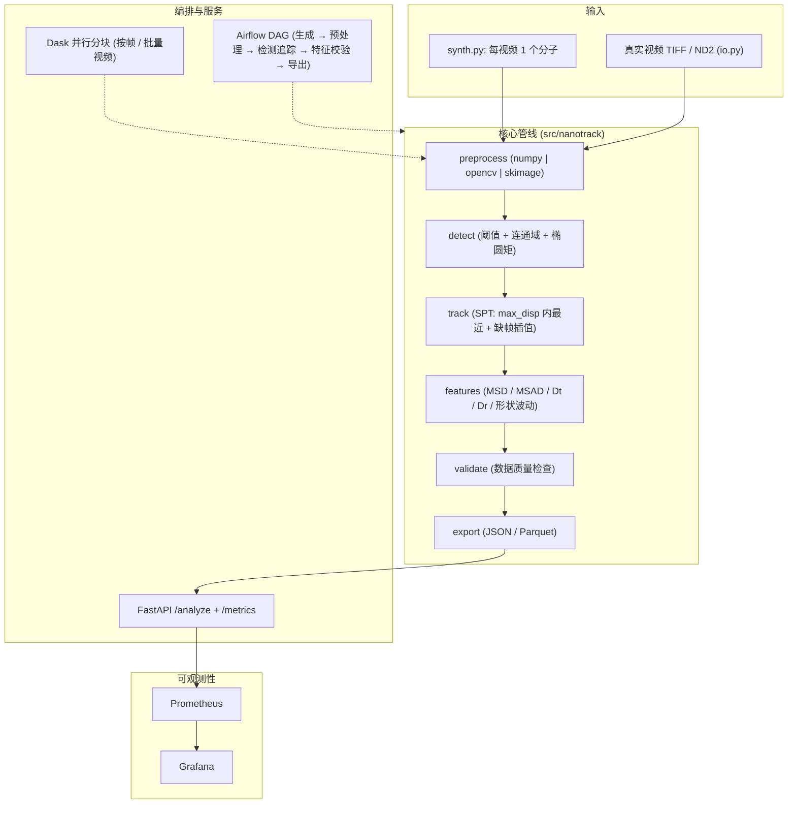

# nanoparticle-video-pipeline — 决策级实施计划（v2）

> **状态**：权威执行规格，取代 [`../phased_plan_cn.md`](../phased_plan_cn.md) 中的高层路线图。
> 范围：**单分子追踪（SPT）**——每个视场只有 1 个分子；多粒子追踪（MPT）明确不在范围内。

## 1. 摘要与现状

仓库目前只有分阶段计划文档（`phased_plan_en.md` / `phased_plan_cn.md`）与 `ref/`
（参考论文 + MATLAB 源码压缩包）。**尚无源码、`.venv`、README、测试或 CI**。现有唯一提交
`5824469 docs: add phased implementation plan (EN/CN)` 已推送到
`github.com/zt5rice/nanoparticle-video-pipeline`（main）。

**目标**：以数据工程风格复刻作者的 MATLAB 纳米颗粒视频分析方法，形成 Python 包
`nanotrack`（0.1.0），分四个阶段交付，配合 Linear 工单、中英双语计划文档、GitHub
Actions CI 与 GitHub 发布。默认用合成数据演示；真实视频加载（TIFF/ND2）受支持但不进 CI。

**算法事实源**：`ref/SWNTs trackingV3.zip`（规范版本 MATLAB 代码）+ `ref/` 四篇论文
（见 §3）。实现必须忠实于 MATLAB 方法：全局阈值二值化 → 孔洞填充 → 连通域 →
矩特征椭圆拟合 → 单目标追踪 + 缺帧插值 → MSD/MSAD 分析 → 数据质量校验 → 导出。

## 2. 已锁定决策（实施中不再改动）

- **单分子 SPT**：每个视频恰好 1 个分子。检测可能找到多个连通域，管线每帧取
  **面积最大的为主目标**，异常在质量报告中标记。不实现多目标关联/合并/分裂。
- 全 4 阶段决策级规格；**Docker 端到端验收只在 GitHub Actions 跑**（本机无 Docker）；
  本机验证到"代码 + 单测 + ruff + uvicorn"级。
- Linear：在团队 `Zhao_tang`（id `f8e0f74b-c3f5-443c-ae81-c15fa9297623`）创建项目
  `nanoparticle-video-pipeline`，4 个里程碑、**22 个工单**（见 §9）；一个工单一个 PR
  （分支 `codex/<issue-id>-<slug>`；commit/PR 前缀 `<ISSUE-ID>: type(scope): ...`）；
  工单仅在对应 PR 合并/关闭后置 Done。
- Python 3.11 + `pip`/`requirements*.txt`（不用 uv/poetry）；包 `nanotrack` 0.1.0；
  MIT 许可；代码注释英文；文档英文 + 中文执行版。
- `ref/`（论文 + 两个 MATLAB 压缩包）**仅本地存放，永不提交/推送**；`.DS_Store`、
  `output/`、`.venv/` 均忽略。
- 网络操作（pip 安装、Linear API、git fetch/push、GitHub 检查）需逐次提权。推送使用
  **用户默认的 GitHub SSH 密钥**（已验证注册到 GitHub 用户 `zt5rice`），无需指定
  自定义密钥文件路径。Phase 4 含推送前置检查门禁（见 §6）。

## 3. 参考资料（`ref/`）

> `ref/` 仅本地存放，永不提交/推送至 GitHub。

| 文件 | 内容 | 在实施中的角色 |
|---|---|---|
| `10186211.pdf` | BNNT 实时布朗运动（棒状、荧光） | MSD/MSAD 方法：内部平均，`MSD=4Dt·Δt+C`、`MSAD=2Dr·Δt+C` |
| `10575298.pdf` | h-BN 纳米片 / 石墨烯二维扩散 | 二维平动扩散、Kramers 理论背景；~18 fps 成像 |
| `SM_d2sm00305h_zt.pdf` | SWCNT 在多孔介质中的 reptation（Soft Matter） | 椭圆拟合 COM/朝向；TA-MSD；旋转抛物线拟合弯曲角；Gittes backbone 协议 |
| `jc1204923.pdf` | Gittes et al. 1993，热涨落测柔韧性 | backbone 提取、弧长切线角、Fourier 模态 / 抛物线弯曲分析 |
| `SWNTs trackingV3.zip` | **规范版** MATLAB 代码 | 直接移植来源（见下方映射） |
| `SWNTs tracking.rar` | 更早开发快照 | 仅溯源；无算法差异（diff 摘要见 `ref/README.md`） |

### 参考文献

1. A. D. Smith McWilliams, Z. Tang, S. Ergülen, C. A. de los Reyes, A. A. Martí, M. Pasquali,
   *Real-Time Visualization and Dynamics of Boron Nitride Nanotubes Undergoing Brownian Motion*,
   J. Phys. Chem. B **2020**, 124 (20), 4185–4192. DOI:
   [10.1021/acs.jpcb.0c03663](https://doi.org/10.1021/acs.jpcb.0c03663).
2. U. Umezaki, A. D. Smith McWilliams, Z. Tang, Z. M. S. He, I. R. Siqueira, S. J. Corr,
   H. Ryu, A. B. Kolomeisky, M. Pasquali, A. A. Martí, *Brownian Diffusion of Hexagonal Boron
   Nitride Nanosheets and Graphene in Two Dimensions*, ACS Nano **2024**, 18 (3), 2446–2454.
   DOI: [10.1021/acsnano.3c11053](https://doi.org/10.1021/acsnano.3c11053).
3. Z. Tang, S. L. Eichmann, B. Lounis, L. Cognet, F. C. MacKintosh, M. Pasquali,
   *Single-walled carbon nanotube reptation dynamics in submicron sized pores from randomly
   packed mono-sized colloids*, Soft Matter **2022**. DOI:
   [10.1039/D2SM00305H](https://doi.org/10.1039/D2SM00305H).
4. F. Gittes, B. Mickey, J. Nettleton, J. Howard, *Flexural Rigidity of Microtubules and Actin
   Filaments Measured from Thermal Fluctuations in Shape*, J. Cell Biol. **1993**, 120 (4),
   923–934. DOI: [10.1083/jcb.120.4.923](https://doi.org/10.1083/jcb.120.4.923).

### 关键参数（来自 `main.m`，V3）

`featsize(masscut)=10`、`stdThreshold=3.0`、`maxdisp=10 px`、`goodenough=20 帧`、
`memory=3 帧`、`fps=16.75`、`inv=0`（暗场荧光）、`100x → 0.302 µm/px`。

### MATLAB → `nanotrack` 映射

| MATLAB（V3） | `nanotrack` 模块 |
|---|---|
| `bpassSWNT`（全局阈值 `(imgstd + stdThreshold*imgmean)/256`，上限 0.90） | `preprocessing.py`（numpy 参考后端） |
| `localmaxFlow`（imfill、bwlabel、regionprops：亮度加权质心、MajorAxisLength、Eccentricity、二阶矩朝向；masscut 过滤） | `detection.py` |
| `trackmem`（Crocker–Grier MPT）→ **简化为 SPT** | `tracking.py`（单目标、`max_disp`、`memory`、`min_track_len`） |
| `putting_in_missing_frames6`（缺失帧线性插值） | `tracking.py` 缺帧补齐 |
| `pixtomicro6`（`0.302 µm/px`） | `config.pixels_per_micron` |
| `conversions_no_dd_SWNT` / `getting_individual_SWNTs` | `pipeline.py`（µm 换算、按轨迹导出） |
| 论文中的 MSD/MSAD | `features.py` |
| Gittes backbone / 弯曲角 | `features.shape_fluctuations()` |

## 4. 系统设计



## 5. 接口与数据契约

### `PipelineConfig`（dataclass + `from_yaml()`）

`backend: "numpy"|"opencv"|"skimage"`（默认 `numpy`）、`image_size: int=512`、
`n_frames: int`、`threshold_mult: float=3.0`、`min_feature_size: int=10`、
`max_disp: float=10.0`、`min_track_len: int=20`、`memory: int=3`、
`fps: float=16.75`、`dt: float=1/16.75`、`pixels_per_micron: float=0.302`、
`noise_sigma: float=8.0`、`background_strength: float=20.0`、
`particle_length_px: int=40`、`particle_width_px: int=6`、
`brownian_step_px: float=0.5`、`angle_step_rad: float=0.03`、
`max_lag: int=min(50, n_frames//2)`、`msd_fit_frac: float=0.25`、
`msd_n_lags: int=40`、
`chunk_size: int=16`、`dask_scheduler: str="threads"`、`seed: int=0`、
`out_dir: str="output"`。

### `synth.generate(cfg) -> (frames: uint8 [T,H,W], ground_truth: dict)`

恰好 **1** 个棒状椭圆高斯亮斑（峰值 ~180–220）在暗背景（~20 + 平滑梯度、
`noise_sigma`）上做 COM 布朗随机游走（`brownian_step_px`）与角度随机游走
（`angle_step_rad`）。

`ground_truth = {"n_molecules": 1, "particles": [{"id": 1, "x", "y", "angle", "length", "width", "area", "intensity"} 每帧]}`

### `preprocess(frame, backend, cfg) -> mask: bool[H,W]`

- `numpy`（参考）：忠实移植 `bpassSWNT` ——
  `thr = (std(std(frame, axis=1)) + threshold_mult*mean(frame))/256`，上限 0.90，
  `mask = frame > thr`。
- `opencv`：同阈值逻辑 + 可选高斯/中值去噪与开运算。
- `skimage`：Otsu 阈值 + 开运算。

验收：三后端主目标位置/数量在容差内一致（不做逐像素一致）。

### `detect(mask, cfg) -> list[Blob]`

`Blob = {"id", "x", "y", "angle", "length", "width", "area", "eccentricity"}`。
孔洞填充（`imfill`）、连通域标记、图像矩（质心=亮像素均值；`MajorAxisLength`；
`Eccentricity`；朝向 `0.5*atan2(2*Mxy, Mxx-Myy)`）；`masscut` 过滤：
`(max(x)-min(x)) + (max(y)-min(y)) > min_feature_size`。

### `track(blobs_per_frame, cfg) -> Track`

单目标追踪：每帧取面积最大 blob；在 `max_disp` 内链接最近 blob；允许连续缺失
`memory` 帧，并用前后帧**线性插值**补齐（`putting_in_missing_frames6` 语义）；
`len(track) < min_track_len` 判废。

`Track = {"track_id": 1, "frames": [{"frame", "x_px", "y_px", "angle", "length", "eccentricity"}], "x_um", "y_um"}`

### `features.summarize(track, cfg)`

每轨输出：`length_mean`、`length_std`、`angle_std`、`eccentricity_mean`、
`diffusion_coefficient_px2_per_s`、`rotational_diffusion_coefficient_rad2_per_s`、
`msd_fit_r2`。MSD/MSAD 用**内部平均**（所有等间隔点对），在约 `msd_n_lags`（默认 40）
个 **log 均匀分布** 的 lag 上求值——对长视频很快，且与已发表论文一致；
`msd_curve_full`/`msad_curve_full` 提供逐 lag 的穷举版本供测试/正确性校验。对前
`msd_fit_frac` 段 lag 线性拟合；`Dt = slope/4`、`Dr = slope/2`。形状波动按 Gittes 协议：
骨架提取 backbone → 弧长参数化 → 切线角 → 旋转抛物线拟合弯曲角（v1 输出均/标准差；
Fourier 模态为可选扩展，不进 v1 验收）。

### `validation.report(track, cfg) -> DataQualityReport`

检查项：帧覆盖率（≥`min_track_len` 且 ≥90% 帧）、长度/朝向合理性、MSD 拟合 `R²≥0.7`、
每帧恰好 1 个主目标（0 或 >1 记告警）。输出 `pass_rate = 通过项/总项`。

### `result.json`

```json
{
  "version": "0.1.0",
  "config": {},
  "n_frames": 40,
  "n_detections": 40,
  "n_tracks": 1,
  "summary": {
    "track_id": 1,
    "length_mean": null,
    "length_std": null,
    "angle_std": null,
    "eccentricity_mean": null,
    "diffusion_coefficient_px2_per_s": null,
    "rotational_diffusion_coefficient_rad2_per_s": null,
    "msd_fit_r2": null
  },
  "quality": {"pass_rate": 0.99, "checks": []}
}
```

### API（Phase 3）

- `GET /health` → `{"status": "ok"}`
- `POST /analyze` body `{"n_frames": int(10..500), "backend": "numpy|opencv|skimage", "image_size"?: int=512, "seed"?: int}` →
  `{"n_frames", "n_tracks", "n_detections", "quality_pass_rate", "tracks": [{track_id, length_mean, length_std, angle_std, eccentricity_mean, diffusion_coefficient_px2_per_s, rotational_diffusion_coefficient_rad2_per_s}]}`
  （非法输入 → 422）。**无 `n_particles` 字段**（单分子）。
- `GET /metrics` → Prometheus 文本；计数器 `nanotrack_frames_total`、
  `nanotrack_errors_total`、直方图 `nanotrack_runtime_seconds`；
  `NANOTRACK_METRICS_ENABLED=false` 可关闭。

### CLI 与 Airflow

- `python scripts/run_pipeline.py --backend {numpy|opencv|skimage} --config config.yaml --out output`
- Airflow DAG `nanoparticle_video_pipeline`：`generate → preprocess → detect_track →
  features_validate → export`，`@daily`、`catchup=False`、LocalExecutor；写出
  `output/latest_result.json`（与 `result.json` 同 schema）。

## 6. 实施阶段

### Phase 0 — 文档与 Linear 初始化

- 创建 `docs/implementation-plan.md`（EN）+ `docs/implementation-plan.zh-CN.md`；
  在 `phased_plan_en/cn.md` 顶部指向本规格；新增 `ref/README.md`（清单 + 溯源）。
- 用 `$MCP_LINEAR_FOR_CODEX` 在团队 `Zhao_tang` 创建项目 `nanoparticle-video-pipeline`、
  4 里程碑、22 个工单（内容按本 v2 规格），记录返回的 issue id。
- **验收**：Linear 可见项目与 22 个工单；文档已提交。

### Phase 1 — 脚手架与核心 NumPy SPT 管线 + 测试

- `.gitignore`（`.venv/`、`output/`、`.DS_Store`）、`LICENSE`（MIT）、`pyproject.toml`、
  `requirements.txt`（头注释 `# nanotrack 0.1.0`）、`requirements-dev.txt`、`Makefile`；
  `python3.11 -m venv .venv` + 安装（需提权）。
- `src/nanotrack/{config,synth,preprocessing,detection,tracking,features,validation,parallel,pipeline}.py`；
  `scripts/{run_pipeline,make_sample_data,smoke_test}.py`。
- 测试：`test_synth`、`test_preprocessing`、`test_detection`、`test_tracking`、
  `test_features`、`test_validation`。
- **验收**：`import nanotrack` 成功；`make smoke` 输出 `SMOKE OK` 且
  `quality_pass_rate>=0.99`（40 帧、1 分子、numpy 后端）；`pytest` 全绿；
  `make sample && make run` 写出符合 schema 的 `output/result.json`。

### Phase 2 — CV 后端、Dask、真实视频、notebook

- 三后端预处理 + 分发器；`io.py`（tifffile TIFF；可选 `nd2`，缺依赖明确报
  `pip install nd2`）；`parallel.py` Dask 分块（按帧/批量视频，顺序回退）；
  `scripts/slurm_example.sh`（批量视频并行叙事）；
  `notebooks/imagej_style_preprocessing.ipynb`（rolling-ball + median + Otsu、
  ImageJ 命令映射、无 JVM）。
- 测试：后端一致性、TIFF 往返（从 `ref/SWNTs trackingV3.zip` 解压 `Artificial8bit.tif`
  到临时目录实测）、Dask == 顺序。
- **验收**：`pytest` 全绿；`--backend opencv|skimage` 成功；notebook 可渲染。

### Phase 3 — API、Airflow、Docker、可观测性

- `api.py` / `metrics.py`（契约见 §5）；`dags/nanoparticle_pipeline.py`；
  `Dockerfile`（python:3.11-slim + uvicorn）、`docker-compose.yml`（postgres:16、
  airflow 2.9.3 LocalExecutor、api、prometheus、grafana）、`prometheus/prometheus.yml`、
  Grafana provisioning（数据源 + `nanotrack-pipeline` 仪表盘）。
- 测试：`test_api`（TestClient：/health、/analyze 正常 + 422、/metrics）、DAG 解析。
- **本机验收**：`uvicorn nanotrack.api:app --port 8000`；curl `/health`、`/analyze`
  （pass_rate≥0.99）、`/metrics`；`pytest` 全绿。
- **CI e2e**：GitHub Actions `docker-e2e` job（ubuntu-latest）：`docker compose up
  --build`，检查 8000/8080/9090/3000，curl 三端点，Airflow 运行写出
  `output/latest_result.json`。

### Phase 4 — CI、文档、GitHub 发布

- `.github/workflows/ci.yml`：`lint-test`（Python 3.11：`ruff check src tests dags` →
  `pytest` → `scripts/smoke_test.py`）+ `docker-e2e`。
- `README.md`（快速开始、架构图、工具映射表、参考文献引用、License）与
  `docs/system-design.md`（本规格的架构图）。`ref/` 本身仅本地存放、不对外发布。
- **推送前置检查门禁**：用**用户默认的 GitHub SSH 密钥**执行 `ssh -T git@github.com`
  （已验证可用，用户 `zt5rice`）；若 `publickey` 失败，暂停并请用户修复密钥
  （或经环境变量提供 HTTPS PAT）。**绝不强推**；非快进 → `git pull --rebase`。
- **验收**：Actions 全绿；GitHub 仓库树完整；Linear 工单随 PR 合并全部 Done。

## 7. 测试计划

- **单元**：synth（1 分子、shape/dtype/ground_truth、seed 可复现）；preprocessing
  （三后端主目标一致性、确定性）；detection（已知椭圆 → x/y/angle/length/ecc 容差内；
  0 目标；取最大 blob）；tracking（连续性、缺帧 ≤ memory 补齐、超限判废、
  超 max_disp 失联）；features（线性 MSD → Dt 容差、MSAD → Dr、角度回绕、弯曲角）；
  validation（通过/失败用例，含多 blob 告警）。
- **集成**：smoke（40 帧 / 1 分子 / pass_rate≥0.99）；sample→run→`result.json` schema；
  三后端 CLI；真实 `Artificial8bit.tif` io 往返。
- **E2E（CI）**：compose 全栈；`/health`、`/analyze`（pass_rate≥0.99）、`/metrics`
  含 `nanotrack_frames_total`；Airflow 成功运行写 `latest_result.json`。
- **门禁**：每阶段全部测试 + 验收命令全绿才进入下一阶段；PR 过 CI 才合并。

## 8. 假设与默认值

- **SPT 为硬约束**：不实现 MPT；配置/API 移除 `n_particles`（`n_molecules=1` 固定）。
- Linear 团队 `Zhao_tang`；项目 `nanoparticle-video-pipeline`；22 工单 / 4 里程碑；
  不设 assignee/截止日期。
- 算法默认参数以 MATLAB V3 为准（`threshold_mult=3`、`min_feature_size=10`、
  `max_disp=10`、`min_track_len=20`、`memory=3`、`fps=16.75`、`0.302 µm/px`）；
  合成数据先用像素默认值，µm 标定留到真实视频验证。
- Gittes 形状波动 v1：仅骨架/切线角/抛物线弯曲角与统计量；Fourier 模态与持久长度为
  可选扩展，不进 v1 验收。
- 网络操作需逐次提权；本机不装 Docker。

## 9. Linear 工单拆分（22）

**Phase 1 — 仓库与核心 SPT 管线（6）**
1. 仓库脚手架：`.gitignore`、LICENSE、pyproject.toml、requirements.txt（+头注释）、requirements-dev.txt、Makefile
2. venv 搭建：`.venv` + `pip install -r requirements-dev.txt`；`import nanotrack` 成功
3. 核心模块：config / synth（1 分子）/ numpy 预处理（MATLAB 阈值移植）/ detection / tracking（SPT）/ features / validation / parallel / pipeline
4. 脚本：run_pipeline.py、make_sample_data.py、smoke_test.py
5. 核心测试：synth / preprocessing / detection / tracking / features / validation
6. 验证：smoke + pytest 全绿 + `output/result.json` schema 检查

**Phase 2 — CV 后端、Dask、真实视频、notebook（6）**
7. OpenCV 与 scikit-image 预处理后端 + 分发器
8. 真实视频加载器：`io.py` TIFF（tifffile）+ ND2（可选 nd2）
9. Dask 并行分块（按帧/批量视频）+ 与顺序结果等价性
10. SLURM 示例脚本
11. ImageJ 风格预处理 notebook
12. 测试：后端 / io 往返（含 `Artificial8bit.tif`）/ 并行等价性

**Phase 3 — 服务、编排、可观测性（6）**
13. FastAPI 应用：/health、/analyze（SPT 契约）、/metrics + 带保护的 Prometheus 指标
14. Airflow DAG：generate → preprocess → detect_track → features_validate → export
15. Dockerfile + docker-compose（postgres / airflow / api / prometheus / grafana）
16. Prometheus 抓取配置 + Grafana provisioning 与仪表盘
17. API 测试 + Airflow DAG 解析测试
18. 验证：uvicorn 端点 + GitHub Actions `docker-e2e`

**Phase 4 — CI/CD、文档、GitHub 发布（4）**
19. GitHub Actions CI：ruff + pytest + smoke（+ `docker-e2e` job）
20. README.md + docs/system-design.md
21. Git 提交并推送到 `github.com/zt5rice/nanoparticle-video-pipeline`（main；SSH 门禁、rebase、不强推）
22. 发布验证：CI 全绿、仓库树确认、Linear 工单 Done
