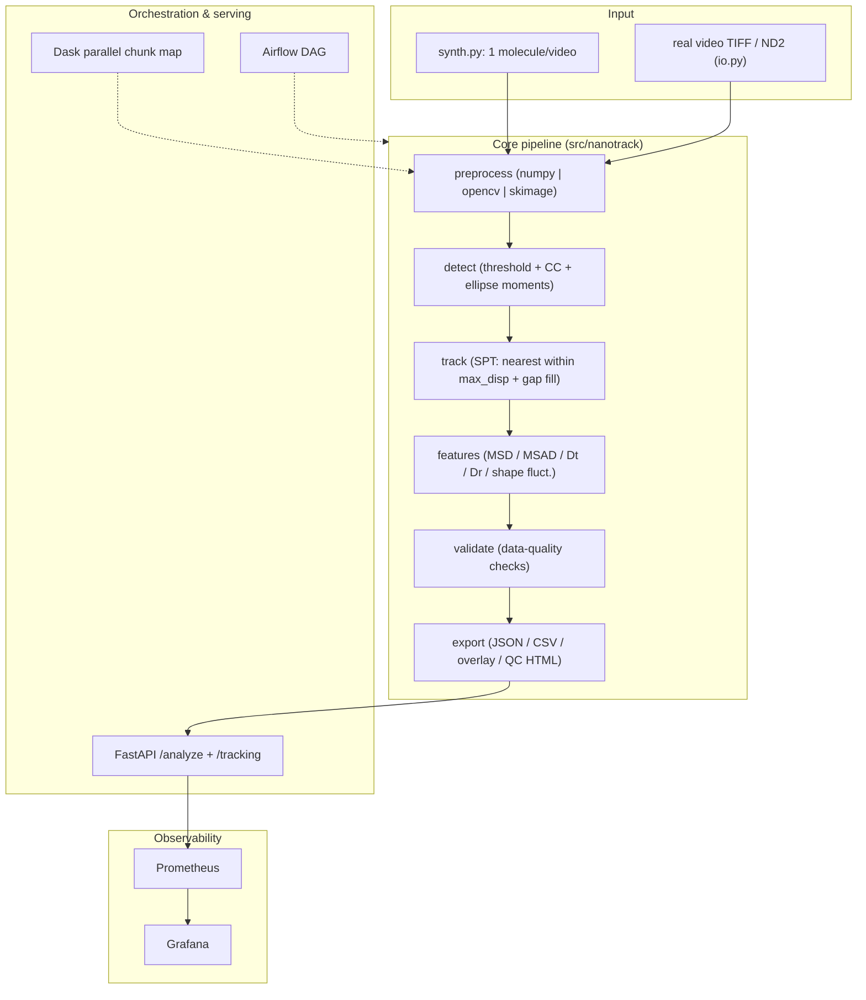

# nanotrack — System Design

## 1. Overview

`nanotrack` is a single-molecule (SPT) nanoparticle video-tracking pipeline built as a
data-infrastructure stack. It reimplements the author's MATLAB methodology as a Python
package (`src/nanotrack`) with a CLI, a FastAPI service, an Airflow DAG, a Docker Compose
deployment, Prometheus/Grafana observability, and GitHub Actions CI/CD.

## 2. Components

| Component | Responsibility |
|---|---|
| `config.py` | `PipelineConfig` dataclass + `from_yaml()`; grouped, commented knobs |
| `synth.py` | synthetic single-molecule video (rod-like ellipse, Brownian + angle walk) + ground truth |
| `preprocessing.py` | three backends: numpy (MATLAB `bpassSWNT` port), opencv, skimage |
| `detection.py` | hole fill, connected components, moment-based ellipse features (COM, angle, length, eccentricity) |
| `tracking.py` | SPT nearest-within-`max_disp`, mod-180° orientation unwrapping, gap-fill interpolation |
| `features.py` | MSD/MSAD (log-spaced lags), Dt=slope/4, Dr=slope/2, shape statistics |
| `validation.py` | data-quality checks → `pass_rate` |
| `export.py` | raw per-frame tracks/detections CSVs, resume reload |
| `report.py` | self-contained Plotly tracking-QC HTML report |
| `overlay.py` | draw trajectory/orientation on the input video (mp4/avi/gif/png) |
| `api.py` / `metrics.py` | FastAPI (`/health`, `/analyze`, `/metrics`, `/tracking`) + guarded Prometheus metrics |
| `parallel.py` | Dask chunk map with sequential fallback |

## 3. Data flow

1. **Input**: synthetic frames or real TIFF/ND2 video (`io.load_video` → uint8 `[T,H,W]`).
2. **Preprocess**: per-frame binary foreground mask (backend-switchable).
3. **Detect**: largest connected component becomes the primary object; ellipse moments
   give x/y/angle/length/eccentricity.
4. **Track**: link the primary object within `max_disp`; up to `memory` missing frames
   are back-filled by linear interpolation; orientation is unwrapped mod 180°.
5. **Features**: MSD/MSAD at ~`msd_n_lags` log-spaced lags; linear fit → `Dt` (px²/s),
   `Dr` (rad²/s); length/angle/eccentricity statistics.
6. **Validate**: frame coverage, length sanity, MSD R², single-primary-object → `pass_rate`.
7. **Export**: `result.json` (summary), `tracks.csv` / `detections.csv` (raw per-frame),
   `config.yaml`, `ground_truth.json`, `tracking_report.html`, optional overlay video.

## 4. Execution paths

- **CLI**: `run_pipeline.py --input video.tif --out output [--backend …] [--overlay]`
  (synthetic when `--input` omitted; `--resume` rebuilds from `detections.csv`).
- **API**: `POST /analyze` runs a synthetic analysis and returns the summary contract;
  `GET /tracking?out=…` serves the QC report; `GET /metrics` exposes Prometheus text.
- **Airflow**: DAG `nanoparticle_video_pipeline`
  (`generate → preprocess → detect_track → features_validate → export`) writes
  `output/latest_result.json`; LocalExecutor, `@daily`, `catchup=False`.

## 5. Deployment (Docker Compose)

| Service | Image / build | Port |
|---|---|---|
| `api` | `./Dockerfile` (python:3.11-slim + uvicorn) | 8000 |
| `airflow-*` | `airflow-image/Dockerfile` (apache/airflow 2.9.3 + slim deps) | 8080 |
| `postgres` | postgres:16 (Airflow metadata) | — |
| `prometheus` | prom/prometheus (scrapes `api:8000/metrics`) | 9090 |
| `grafana` | grafana/grafana (provisioned `nanotrack-pipeline` dashboard) | 3000 |

Airflow containers run as a non-root user, so `./output` must be writable
(`mkdir -p output && chmod -R 777 output` before `docker compose up --build`).

## 6. Observability

- `nanotrack_frames_total` (counter), `nanotrack_errors_total` (counter),
  `nanotrack_runtime_seconds` (histogram); disable via `NANOTRACK_METRICS_ENABLED=false`.
- Grafana dashboard `nanotrack-pipeline`: frames rate, error rate, p95 runtime.

## 7. CI/CD

`.github/workflows/ci.yml`:
- `lint-test`: `pip install -r requirements-dev.txt` → `ruff check src tests dags` →
  `pytest` → `scripts/smoke_test.py`.
- `docker-e2e`: `docker compose up --build` → API/infra health waits → `/analyze`,
  `/metrics` checks → `airflow dags test` writes `output/latest_result.json`.

## 8. Reproducibility

- Every run persists config, raw per-frame data, ground truth, and QC artifacts.
- `--resume` reuses `detections.csv` so expensive image analysis is not repeated.
- Reference papers and the original MATLAB source are kept local in `ref/` (not pushed).

## 9. References

See [`docs/implementation-plan.md`](implementation-plan.md) for the decision-complete
spec and the full reference list (J. Phys. Chem. B 2020; ACS Nano 2024; Soft Matter 2022;
J. Cell Biol. 1993).

