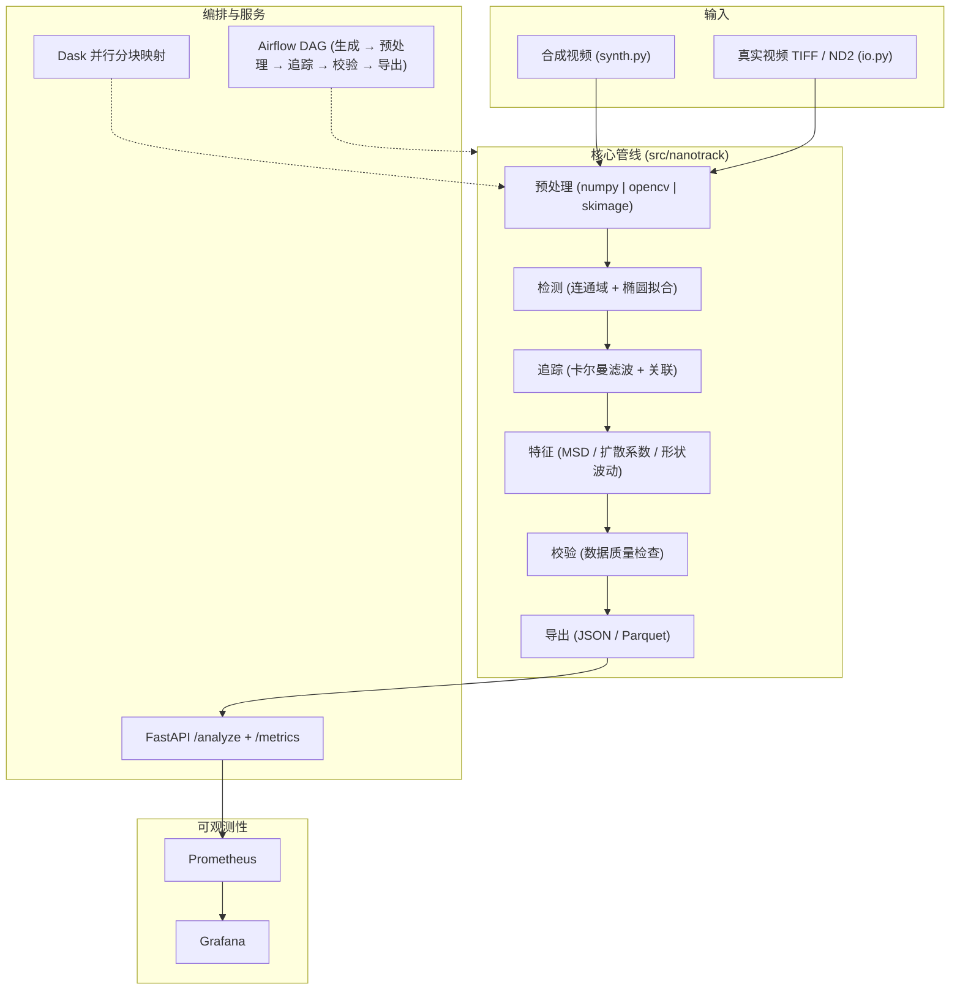

<div align="center">
  <a href="phased_plan_en.md">English</a> · <strong>中文</strong>
</div>

# nanoparticle-video-pipeline 分阶段实施计划

## 概述

保持已确认的整体设计不变：用数据工程风格重新实现作者在 MATLAB 中开发的纳米颗粒视频分析方法论，按四个阶段推进：**仓库与核心管线 → CV/并行/真实视频后端 → 服务、编排与可观测性 → CI/CD、文档与 GitHub 发布**。最终仓库位于 `<repo-root>`（Python 3.11 的 `.venv`，包 `nanotrack` 0.1.0），并推送到 `github.com/zt5rice/nanoparticle-video-pipeline`（main 分支）。每个阶段都有明确的交付物、验收标准与验证清单。全栈包括：纯 NumPy 核心（自写算法）+ OpenCV/scikit-image 预处理后端 + Dask 并行 + Airflow DAG + FastAPI/Prometheus/Grafana + Docker Compose + GitHub Actions CI + 真实视频加载（TIFF/ND2）+ ImageJ 风格预处理 notebook。

### 系统设计图



### 核心依赖

**包元数据（`pyproject.toml`）** — `name = "nanotrack"`，`version = "0.1.0"`，`license = MIT`，`requires-python = ">=3.10"`，包目录 `src/`。

**`requirements.txt`（运行时，最低版本约束，文件头注释 `# nanotrack 0.1.0`）**

```
numpy>=1.24
pandas>=2.0
scipy>=1.10
scikit-image>=0.21
opencv-python-headless>=4.8
scikit-learn>=1.3
dask[array]>=2023.8
fastapi>=0.104
uvicorn[standard]>=0.24
prometheus-client>=0.19
pyyaml>=6.0
pydantic>=2.4
tifffile>=2023.7
nd2>=0.9
```

**`requirements-dev.txt`** — `-r requirements.txt` + `-e .`（在 venv 中注册 `nanotrack`）+ `pytest>=7.4` + `ruff>=0.1`。

**容器镜像（docker-compose）** — `python:3.11-slim`（API）、`apache/airflow:2.9.3-python3.11`（LocalExecutor）、`postgres:16`（Airflow 元数据）、`prom/prometheus:latest`、`grafana/grafana:latest`。

## 阶段 1：仓库脚手架、venv 与核心 NumPy 管线 + 测试

- 仓库重组：在 `<repo-root>` 创建 `.gitignore`、`LICENSE`（MIT）、`pyproject.toml`、`requirements.txt`、`requirements-dev.txt`、`Makefile`；创建 `.venv`（Python 3.11）并安装 `requirements-dev.txt`；在 `requirements.txt` 顶部添加包含包名/版本号的注释。
- 核心库 `src/nanotrack/`：
  - `config.py` — `PipelineConfig` 数据类（backend、n_frames、n_particles、image_size、noise、background_strength、min_area、max_track_dist、dt、max_lag、chunk_size、dask_scheduler、out_dir）+ `from_yaml()`。
  - `synth.py` — 合成显微镜风格视频：棒状椭圆颗粒做二维布朗运动（x/y/角度随机游走）；返回 `(uint8 frames, ground_truth dict)`；纯 NumPy。
  - `preprocessing.py` — NumPy 参考后端：背景扣除（box blur）、高斯去噪、Otsu 阈值、形态学开运算。
  - `detection.py` — 自写连通域标记 + 椭圆拟合区域属性（id/x/y/angle/length/width/area）。
  - `tracking.py` — 自写匀速卡尔曼滤波 + 贪心最近邻关联。
  - `features.py` — `msd_curve()`、`diffusion_coefficient()`（NumPy polyfit；可选 sklearn）、`shape_fluctuations()`、`summarize()`。
  - `validation.py` — pandas 数据质量检查 → `DataQualityReport(pass_rate)`。
  - `parallel.py` — 使用 Dask 的分块映射；顺序回退（阶段 1 不依赖 Dask）。
  - `pipeline.py` — 编排器 `run(frames, cfg) -> {n_frames, n_detections, n_tracks, summary, quality}`。
- 脚本：`run_pipeline.py`（CLI）、`make_sample_data.py`、`smoke_test.py`（仅 NumPy 端到端）。
- 测试：`test_synth`、`test_detection`、`test_tracking`、`test_features`、`test_validation`。
- 验收：
  - `.venv/bin/python -c "import nanotrack"` 成功；`make smoke` 输出 `SMOKE OK` 且 `quality_pass_rate >= 0.99`。
  - `pytest` 全部通过；`make sample && make run` 写出符合预期结构的 `output/result.json`。
- 验证清单：
  - venv 在仓库内创建，所有命令都使用它（不使用系统/捆绑解释器）
  - `python scripts/smoke_test.py` 通过（NumPy 后端，40 帧，3 个颗粒）
  - `pytest` 全绿
  - `output/result.json` 包含 `n_frames / n_detections / n_tracks / summary / quality`

## 阶段 2：OpenCV/scikit-image 后端、Dask 并行、真实视频支持与 ImageJ 风格 notebook

- `preprocessing.py` — 增加 `opencv` 与 `skimage` 后端（GaussianBlur/median、Otsu、形态学）+ 分发器 `preprocess(frame, backend=...)`；保留 NumPy 作为参考后端。
- `io.py` — 真实视频加载器：通过 `tifffile` 读 TIFF 堆栈，通过可选 `nd2` 导入读 ND2；返回 `(frames, meta)`；可选依赖缺失时给出清晰报错。
- `parallel.py` — 带调度器选项的 Dask delayed 分块映射；验证 Dask 结果与顺序结果一致。
- `scripts/slurm_example.sh` — 展示集群并行化的 SLURM 作业脚本（呼应“15 小时 → 30 分钟”提速叙事）。
- `notebooks/imagej_style_preprocessing.ipynb` — 用 Python 实现 rolling-ball 背景扣除 + 中值滤波 + Otsu，带前后对比可视化，并用 Markdown 说明与 ImageJ 命令（Subtract Background / Median / Auto Threshold）的对应关系。不依赖 Java/pyimagej。
- 测试：`test_preprocessing`（三个后端在合成帧上都能产出有效掩码）、`test_io`（把合成 TIFF 写入临时目录再读回）、`test_parallel`（Dask 输出 == 顺序输出）。
- 验收：`pytest` 含新测试全绿；三个预处理后端都能通过 `scripts/run_pipeline.py --backend {numpy|opencv|skimage}` 运行。
- 验证清单：
  - `python scripts/run_pipeline.py --backend opencv` 与 `--backend skimage` 均成功
  - TIFF 加载测试通过；ND2 加载在缺少依赖时给出明确的“install nd2”报错
  - notebook 可渲染并展示处理前后画面

## 阶段 3：FastAPI 服务、Airflow 编排与可观测性

- `api.py` + `metrics.py` — FastAPI 应用，提供 `GET /health`、`POST /analyze`、`GET /metrics`；带保护的 Prometheus 计数器/直方图（`nanotrack_frames_total`、`nanotrack_errors_total`、`nanotrack_runtime_seconds`）。
- `dags/nanoparticle_pipeline.py` — Airflow DAG `nanoparticle_video_pipeline`（`@daily` 调度、LocalExecutor、任务 `generate → preprocess → detect_track → features_validate → export`），写入中间产物与 `output/latest_result.json`。
- Docker：`Dockerfile`（python:3.11-slim + uvicorn）、`docker-compose.yml`（postgres、airflow-init/webserver/scheduler、api、prometheus、grafana）、`prometheus/prometheus.yml`、Grafana provisioning 数据源 + 仪表盘（`nanotrack-pipeline`）。
- 测试：`test_api`（FastAPI TestClient 测 `/health`、`/analyze`、`/metrics`）、Airflow DAG 导入/解析测试。
- 验收：
  - `uvicorn nanotrack.api:app --port 8000` 可提供 `/health`、`/analyze`、`/metrics`。
  - `docker compose up --build` 启动 API（8000）、Airflow（8080）、Prometheus（9090）、Grafana（3000）；Airflow DAG 运行并写出 `output/latest_result.json`。
- API 契约：
  - `GET /health` → `{"status": "ok"}`
  - `POST /analyze` 请求体 `{"n_frames": int(10..500), "n_particles": int(1..20), "backend": "numpy|opencv|skimage"}` → `{"n_frames", "n_tracks", "n_detections", "quality_pass_rate", "tracks": [{"track_id", "length_mean", "length_std", "angle_std", "diffusion_coefficient_px2_per_s"}]}`
  - `GET /metrics` → Prometheus 文本格式
- 验证清单：
  - `curl localhost:8000/health` 返回 ok
  - `curl -X POST localhost:8000/analyze -d '{"n_frames":60,"n_particles":3,"backend":"numpy"}'` 返回 `quality_pass_rate >= 0.99`
  - `curl localhost:8000/metrics` 出现 `nanotrack_frames_total`
  - Airflow UI 中能看到该 DAG，且 `output/latest_result.json` 存在成功运行结果

## 阶段 4：CI/CD、文档与 GitHub 发布

- `.github/workflows/ci.yml` — Python 3.11：`pip install -r requirements-dev.txt` → `ruff check src tests dags` → `pytest` → `python scripts/smoke_test.py`。
- 文档：`README.md`（快速开始、架构图、工具映射表、许可证）与 `docs/system-design.md`（本文档）。
- Git：`git init -b main`，add，commit（约定式提交信息），设置远端 `git@github.com:zt5rice/nanoparticle-video-pipeline.git`，使用 `GIT_SSH_COMMAND="ssh -i <user-ssh-key> -o IdentitiesOnly=yes"` 推送到 `main`；若远端已有初始提交，先 `git fetch` + `git pull --rebase`（绝不强推）。
- 验收：本地 ruff/pytest/smoke 全绿；提交已推送；GitHub 仓库显示完整目录树且 CI 通过。
- 验证清单：
  - `.venv/bin/python -m ruff check src tests dags` 无告警
  - `pytest` 全绿；`python scripts/smoke_test.py` 全绿
  - `git log --oneline` 显示该提交；`git remote -v` 指向 GitHub 仓库
  - GitHub Actions 运行通过（或首次运行后添加徽章）

## 假设与默认值

- 阶段顺序严格遵循用户指定（仓库/核心 → CV/并行/真实视频 → 服务/编排/可观测性 → CI/文档/发布），与参考项目的分阶段计划风格一致。
- 仓库文档均为英文；demo 默认使用合成数据；真实视频加载器（TIFF/ND2）受支持但不要求进入 CI。
- “ImageJ 风格预处理”指 Python 等价实现（rolling-ball/median/Otsu），不是 pyimagej/JVM；不追求复现 ImageJ 的逐字节输出。
- 沙箱内 GitHub 网络不可达，且 `<repo-root>` 不在沙箱可写目录内：实施时先在 暂存工作区暂存文件，再对复制/venv/网络/push 步骤申请提权。若 git MCP 工具可用则优先使用；否则用 git CLI + 现有 SSH 密钥。
- Python 版本固定为 3.11；所有命令使用仓库本地 `.venv`。
- 推送目标为 `main`；非快进情况通过 rebase 处理，绝不强推。

## 任务拆分（用于 Linear 项目/工单，共 22 个）

**阶段 1 — 仓库与核心管线（6）**
- [Phase1] 仓库脚手架：`.gitignore`、LICENSE、pyproject.toml、requirements.txt（含包信息头注释）、requirements-dev.txt、Makefile
- [Phase1] venv 搭建：创建 `.venv` 并 `pip install -r requirements-dev.txt` 成功；`import nanotrack` 可用
- [Phase1] 核心模块：config / synth / numpy 预处理 / detection / tracking / features / validation / parallel / pipeline
- [Phase1] 脚本：run_pipeline.py、make_sample_data.py、smoke_test.py
- [Phase1] 核心测试：synth / detection / tracking / features / validation
- [Phase1] 验证：smoke test + pytest 全绿 + `output/result.json` 结构检查

**阶段 2 — CV 后端、Dask、真实视频、notebook（6）**
- [Phase2] OpenCV 与 scikit-image 预处理后端 + 分发器
- [Phase2] 真实视频加载器：`io.py` TIFF（tifffile）+ ND2（可选 nd2）
- [Phase2] Dask 并行分块映射 + 与顺序结果等价性检查
- [Phase2] SLURM 示例脚本
- [Phase2] ImageJ 风格预处理 notebook
- [Phase2] 测试：预处理后端 / io 往返 / 并行等价性

**阶段 3 — 服务、编排、可观测性（6）**
- [Phase3] FastAPI 应用：/health、/analyze、/metrics + 带保护的 Prometheus 指标
- [Phase3] Airflow DAG：generate → preprocess → detect_track → features_validate → export
- [Phase3] Dockerfile + docker-compose（postgres / airflow / api / prometheus / grafana）
- [Phase3] Prometheus 抓取配置 + Grafana provisioning 与仪表盘
- [Phase3] API 测试 + Airflow DAG 解析测试
- [Phase3] 验证：uvicorn 端点 + `docker compose up --build` 端到端

**阶段 4 — CI/CD、文档、GitHub 发布（4）**
- [Phase4] GitHub Actions CI：ruff + pytest + smoke
- [Phase4] README.md 快速开始 + docs/system-design.md
- [Phase4] Git init/commit 并推送到 `github.com/zt5rice/nanoparticle-video-pipeline`（main）
- [Phase4] 发布验证：GitHub 上 CI 变绿、仓库目录树确认
