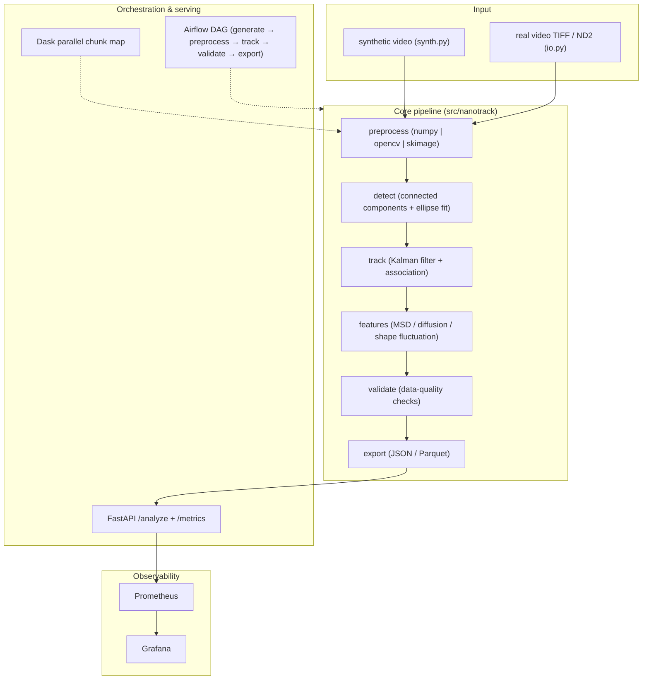

<div align="center">
  <strong>English</strong> · <a href="phased_plan_cn.md">中文</a>
</div>

> **NOTE (2026-08-23)**: This document is the high-level roadmap. The authoritative,
> decision-complete execution spec is **[docs/implementation-plan.md](docs/implementation-plan.md)**
> (Chinese execution version: [docs/implementation-plan.zh-CN.md](docs/implementation-plan.zh-CN.md)).
> Scope updated: **single-molecule tracking (SPT)** — exactly one molecule per field of
> view; multi-particle tracking is out of scope. Reference papers and MATLAB source are
> in [`ref/`](ref/README.md).

# nanoparticle-video-pipeline Phased Implementation Plan

## Summary

Keep the confirmed overall design unchanged: a data-engineering–style reimplementation of the author's MATLAB nanoparticle video-analysis methodology, progressing through four phases as specified: **repo & core pipeline → CV/parallel/real-video backends → serving, orchestration & observability → CI/CD, docs & GitHub release**. The final repo lives in this repository (Python 3.11 `.venv`, package `nanotrack` 0.1.0), and is pushed to `github.com/zt5rice/nanoparticle-video-pipeline` (main). Each phase has clear deliverables, acceptance criteria, and a verification checklist. Full stack includes: pure-NumPy core (self-written algorithms) + OpenCV/scikit-image preprocessing backends + Dask parallelism + Airflow DAG + FastAPI/Prometheus/Grafana + Docker Compose + GitHub Actions CI + real-video loaders (TIFF/ND2) + ImageJ-style preprocessing notebook.

### System design diagram



### Core dependencies

**Package metadata (`pyproject.toml`)** — `name = "nanotrack"`, `version = "0.1.0"`, `license = MIT`, `requires-python = ">=3.10"`, package-dir `src/`.

**`requirements.txt` (runtime, minimum bounds, header comment `# nanotrack 0.1.0`)**

```
numpy>=1.24
pandas>=2.0
scipy>=1.10
scikit-image>=0.21
opencv-python-headless>=4.8
scikit-learn>=1.3
dask[array]>=2023.8
fastapi>=0.104
uvicorn[standard]>=0.24
prometheus-client>=0.19
pyyaml>=6.0
pydantic>=2.4
tifffile>=2023.7
nd2>=0.9
```

**`requirements-dev.txt`** — `-r requirements.txt` + `-e .` (registers `nanotrack` in the venv) + `pytest>=7.4` + `ruff>=0.1`.

**Container images (docker-compose)** — `python:3.11-slim` (API), `apache/airflow:2.9.3-python3.11` (LocalExecutor), `postgres:16` (Airflow metadata), `prom/prometheus:latest`, `grafana/grafana:latest`.

## Phase 1: Repo Scaffold, venv, and Core NumPy Pipeline + Tests

- Repo restructure: create at the repository root: `.gitignore`, `LICENSE` (MIT), `pyproject.toml`, `requirements.txt`, `requirements-dev.txt`, `Makefile`; create `.venv` (Python 3.11) and install `requirements-dev.txt`; add a header comment to `requirements.txt` with the package name/version.
- Core library `src/nanotrack/`:
  - `config.py` — `PipelineConfig` dataclass (backend, n_frames, n_particles, image_size, noise, background_strength, min_area, max_track_dist, dt, max_lag, chunk_size, dask_scheduler, out_dir) + `from_yaml()`.
  - `synth.py` — synthetic microscopy-style video of rod-like ellipses doing 2D Brownian motion (x/y/angle random walk); returns `(uint8 frames, ground_truth dict)`; pure NumPy.
  - `preprocessing.py` — NumPy reference backend: background subtraction (box blur), Gaussian denoise, Otsu threshold, morphology open.
  - `detection.py` — self-written connected-components labeling + ellipse-fit region props (id/x/y/angle/length/width/area).
  - `tracking.py` — self-written constant-velocity Kalman filter + greedy nearest-neighbor association.
  - `features.py` — `msd_curve()`, `diffusion_coefficient()` (NumPy polyfit; optional sklearn), `shape_fluctuations()`, `summarize()`.
  - `validation.py` — pandas data-quality checks → `DataQualityReport(pass_rate)`.
  - `parallel.py` — chunk-map with Dask; sequential fallback (no Dask dependency needed in Phase 1).
  - `pipeline.py` — orchestrator `run(frames, cfg) -> {n_frames, n_detections, n_tracks, summary, quality}`.
- Scripts: `run_pipeline.py` (CLI), `make_sample_data.py`, `smoke_test.py` (NumPy-only end-to-end).
- Tests: `test_synth`, `test_detection`, `test_tracking`, `test_features`, `test_validation`.
- Acceptance:
  - `.venv/bin/python -c "import nanotrack"` succeeds; `make smoke` prints `SMOKE OK` with `quality_pass_rate >= 0.99`.
  - `pytest` all green; `make sample && make run` writes `output/result.json` with the expected schema.
- Verification checklist:
  - venv created inside repo and used for all commands (no system/bundled interpreter)
  - `python scripts/smoke_test.py` passes (NumPy backend, 40 frames, 3 particles)
  - `pytest` green
  - `output/result.json` contains `n_frames / n_detections / n_tracks / summary / quality`

## Phase 2: OpenCV/scikit-image Backends, Dask Parallelism, Real-Video Support, and ImageJ-Style Notebook

- `preprocessing.py` — add `opencv` and `skimage` backends (GaussianBlur/median, Otsu, morphology) + dispatcher `preprocess(frame, backend=...)`; keep NumPy as the reference backend.
- `io.py` — real-video loaders: TIFF stacks via `tifffile`, ND2 via optional `nd2` import; returns `(frames, meta)`; clear error message if an optional dependency is missing.
- `parallel.py` — Dask delayed chunk map with scheduler option; verify Dask results match sequential results.
- `scripts/slurm_example.sh` — SLURM job script demonstrating cluster parallelization (mirrors the original "15 hours → 30 minutes" speedup narrative).
- `notebooks/imagej_style_preprocessing.ipynb` — rolling-ball background subtraction + median filter + Otsu in Python, with before/after visualizations and a markdown mapping to ImageJ commands (Subtract Background / Median / Auto Threshold). No Java/pyimagej dependency.
- Tests: `test_preprocessing` (all three backends produce valid masks on synthetic frames), `test_io` (write synthetic TIFF to a temp dir and load back), `test_parallel` (Dask output == sequential output).
- Acceptance: `pytest` green including new tests; all three preprocessing backends run via `scripts/run_pipeline.py --backend {numpy|opencv|skimage}`.
- Verification checklist:
  - `python scripts/run_pipeline.py --backend opencv` and `--backend skimage` both succeed
  - TIFF loader test passes; ND2 loader raises a clear "install nd2" error when unavailable
  - notebook renders and shows before/after frames

## Phase 3: FastAPI Serving, Airflow Orchestration, and Observability

- `api.py` + `metrics.py` — FastAPI app with `GET /health`, `POST /analyze`, `GET /metrics`; guarded Prometheus counters/histograms (`nanotrack_frames_total`, `nanotrack_errors_total`, `nanotrack_runtime_seconds`).
- `dags/nanoparticle_pipeline.py` — Airflow DAG `nanoparticle_video_pipeline` (schedule `@daily`, LocalExecutor, tasks `generate → preprocess → detect_track → features_validate → export`), writing intermediates and `output/latest_result.json`.
- Docker: `Dockerfile` (python:3.11-slim + uvicorn), `docker-compose.yml` (postgres, airflow-init/webserver/scheduler, api, prometheus, grafana), `prometheus/prometheus.yml`, Grafana provisioning datasource + dashboard (`nanotrack-pipeline`).
- Tests: `test_api` (FastAPI TestClient on `/health`, `/analyze`, `/metrics`), Airflow DAG import/parse test.
- Acceptance:
  - `uvicorn nanotrack.api:app --port 8000` serves `/health`, `/analyze`, `/metrics`.
  - `docker compose up --build` brings up API (8000), Airflow (8080), Prometheus (9090), Grafana (3000); Airflow DAG runs and writes `output/latest_result.json`.
- API contract:
  - `GET /health` → `{"status": "ok"}`
  - `POST /analyze` body `{"n_frames": int(10..500), "n_particles": int(1..20), "backend": "numpy|opencv|skimage"}` → `{"n_frames", "n_tracks", "n_detections", "quality_pass_rate", "tracks": [{"track_id", "length_mean", "length_std", "angle_std", "diffusion_coefficient_px2_per_s"}]}`
  - `GET /metrics` → Prometheus text format
- Verification checklist:
  - `curl localhost:8000/health` returns ok
  - `curl -X POST localhost:8000/analyze -d '{"n_frames":60,"n_particles":3,"backend":"numpy"}'` returns `quality_pass_rate >= 0.99`
  - `curl localhost:8000/metrics` shows `nanotrack_frames_total`
  - Airflow UI lists the DAG and a successful run exists in `output/latest_result.json`

## Phase 4: CI/CD, Documentation, and GitHub Release

- `.github/workflows/ci.yml` — Python 3.11: `pip install -r requirements-dev.txt` → `ruff check src tests dags` → `pytest` → `python scripts/smoke_test.py`.
- Docs: `README.md` (quickstart, architecture diagram, tooling-mapping table, license) and `docs/system-design.md` (this document).
- Git: `git init -b main`, add, commit (conventional message), set remote `git@github.com:zt5rice/nanoparticle-video-pipeline.git`, push to `main` using the user's default GitHub SSH key; if the remote already has an initial commit, `git fetch` + `git pull --rebase` first (no force).
- Acceptance: local ruff/pytest/smoke all green; commit pushed; GitHub repo shows the full tree and CI passes.
- Verification checklist:
  - `.venv/bin/python -m ruff check src tests dags` clean
  - `pytest` green; `python scripts/smoke_test.py` green
  - `git log --oneline` shows the commit; `git remote -v` points to the GitHub repo
  - GitHub Actions run is green (or badge added after first run)

## Assumptions & Defaults

- Phase order strictly follows the user's specification (repo/core → CV/parallel/real-video → serving/orchestration/observability → CI/docs/release), matching the reference project's phased-plan style.
- All repo docs are English; demo runs on synthetic data by default; real-video loaders (TIFF/ND2) are supported but not required for CI.
- "ImageJ-style preprocessing" means Python equivalents (rolling-ball/median/Otsu), not pyimagej/JVM; exact ImageJ binary output is not reproduced.
- Network (GitHub) is blocked inside the sandbox and the repository root is outside the sandbox writable roots: implementation will stage files in a staging workspace, then request escalation for copy/venv/network/push steps. Git MCP tools will be used if available; otherwise git CLI with the user's default SSH key.
- Python version pinned to 3.11; all commands use the repo-local `.venv`.
- Push target is `main`, non-fast-forward handled by rebase, never force-push.

## Ticket Breakdown (for Linear project / tickets, 22 total)

**Phase 1 — Repo & core pipeline (6)**
- [Phase1] Repo scaffold: `.gitignore`, LICENSE, pyproject.toml, requirements.txt (+ package header), requirements-dev.txt, Makefile
- [Phase1] venv setup: `.venv` created and `pip install -r requirements-dev.txt` succeeds; `import nanotrack` works
- [Phase1] Core modules: config / synth / numpy preprocessing / detection / tracking / features / validation / parallel / pipeline
- [Phase1] Scripts: run_pipeline.py, make_sample_data.py, smoke_test.py
- [Phase1] Core tests: synth / detection / tracking / features / validation
- [Phase1] Verification: smoke test + pytest green + `output/result.json` schema check

**Phase 2 — CV backends, Dask, real video, notebook (6)**
- [Phase2] OpenCV and scikit-image preprocessing backends + dispatcher
- [Phase2] Real-video loaders: `io.py` TIFF (tifffile) + ND2 (optional nd2)
- [Phase2] Dask parallel chunk map with sequential equivalence check
- [Phase2] SLURM example script
- [Phase2] ImageJ-style preprocessing notebook
- [Phase2] Tests: preprocessing backends / io roundtrip / parallel equivalence

**Phase 3 — Serving, orchestration, observability (6)**
- [Phase3] FastAPI app: /health, /analyze, /metrics + guarded Prometheus metrics
- [Phase3] Airflow DAG: generate → preprocess → detect_track → features_validate → export
- [Phase3] Dockerfile + docker-compose (postgres / airflow / api / prometheus / grafana)
- [Phase3] Prometheus scrape config + Grafana provisioning and dashboard
- [Phase3] API tests + Airflow DAG parse test
- [Phase3] Verification: uvicorn endpoints + `docker compose up --build` end-to-end

**Phase 4 — CI/CD, docs, GitHub release (4)**
- [Phase4] GitHub Actions CI: ruff + pytest + smoke
- [Phase4] README.md quick-start + docs/system-design.md
- [Phase4] Git init/commit and push to `github.com/zt5rice/nanoparticle-video-pipeline` (main)
- [Phase4] Release verification: green CI on GitHub, repo tree confirmed
